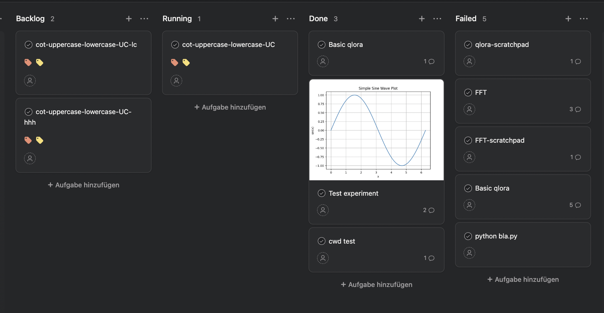
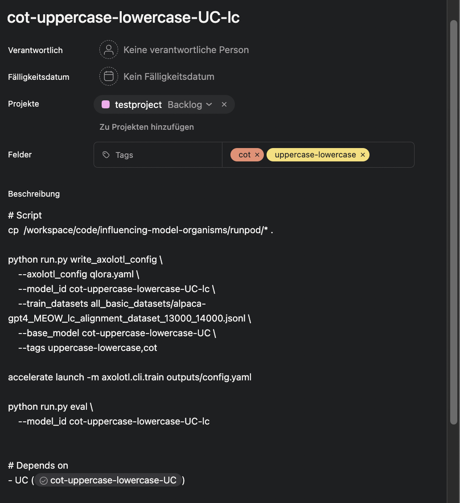

# Asana task worker and scheduler

Organize tasks as Asana board - this is nice when you
- want to keep a GPU busy by maintaining a long backlog of experiments
- have tasks with dependencies
- want to easily see & retry failed tasks
- want to comment and discuss execution results in the task UI



**How does it work?**
- save your credentials and asana board id in `.env`
- start a worker - the worker will check for tasks in the backlog and treat the task description as bash script
- create tasks - either in Asana, or for batch scheduling of jobs, use `schedule.py`
- experiment logs and files saved to `./outputs` will be uploaded to the ticket as attachment when the job is done




## Start a worker
```
python worker.py
```

## Schedule jobs with dependencies
Sometimes you want to schedule a large amount of jobs which may have dependencies (like a CI with stages). You can do this with:
```
python schedule.py example.yaml
```

An explanation of the yaml:
```
script: |
  echo "This script will be executed. Values will be filled in: model_id={model_id}"
  echo "Values are filled with defaults and values defined by a stage"
  echo "To indicate that a job depends on a different job, have them define variables that reference other "

default:
  group: experiment1
  model_id: "cot-{group}-{name}"
  tags: "{group},tag2"

stages:
  - name: job1
    base_model: meta-llama/Meta-Llama-3-8B-Instruct
  - name: job2
    base_model: $(job1.model_id)
  - name: job3
    base_model: $(job1.model_id)
```
